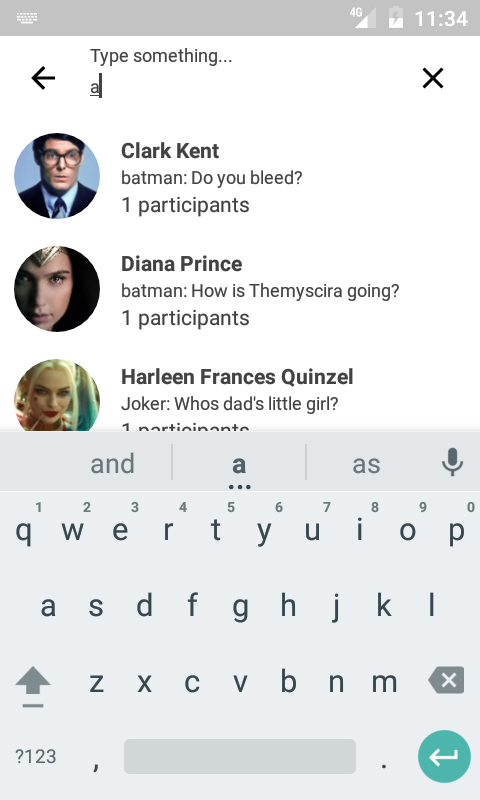

# Android Search Interface

<a name="version"></a>[  ](https://bintray.com/edsilfer/maven/search-interface/_latestVersion) - **MIN API VERSION: 16**

<a name="summary">
	
## Summary
1. [Introduction](#introduction) 
2. [How does it work?](#howdoesitwork) 
   * [Step 01](#step1) 
   * [Step 02](#step2) 
   * [Step 03](#step3) 
   * [Step 04](#step4) 
   * [Step 05](#step5) 
2. [Next Steps](#next-steps)
3. [License](#license) 

<a name="introduction" />

## Introduction
While developing an application, a very common functionality is to perform searches - either, locally or remotelly - and let the user to select between a set of items. To achive this feature it is required, at least, a `Fragment` or `Activity` containing a `RecyclerView`, different row layouts, `RecyclerviewAdapte`r and its `ViewHolders`, all of that if the developer applies reusability very well. In order to ensure code orthogonality, Android Search Interface comes to offer the developer with a common but flexible interface to create Search/Select Business Streams.

<a name="showcase" />

### SHOWCASE

<p align="center">
  
  
  
  
  
  <br /><br />
  <i><b>Figure 01:</b> sample searches provided through presets or custom styles</i>
</p>

<a name="howdoesitwork" />

## How does it work?
Android List Manager was developed using [Kotlin language](https://kotlinlang.org/). Kotlin is free to use and owned by [Jet Brains](https://www.jetbrains.com/). It adds a lot of cool features, boosting your productiveness while keeping everythying **100% compatible with Java.** 

_For details about technical implementation of this library please refer to the source code._

<a name="step1" />

#### Step 01: import the module

Add the library module dependency to your project:
```groovy
compile 'br.com.edsilfer.android:search-interface:1.1.0'
```

_Please refer to the [badge](#version) of the page to get the latest version of this library._

<a name="step2" />

#### Step 02: make your POJO class extends `IResultRow`

The model class whose items you intend to display as search result must implement the interface below:

```kotlin
interface IResultRow : Serializable {

    fun getThumbnail(): String

    fun getHeader(): String

    fun getSubHeader1(): String

    fun getSubHeader2(): String

}
```

<a name="step3" />

#### Step 03: subscribe for search events
```kotlin
 NotificationCenter.subscribe(Events.ON_SEARCH_TYPED, object : ISubscriber {
            override fun execute(event: Events, payload: Any) {
            }
        }))

 NotificationCenter.subscribe(Events.ITEM_CHOSEN, object : ISubscriber {
            override fun execute(event: Events, payload: Any) {
            }
        })
```
- Event  `Events.ON_SEARCH_TYPED` is called whenever user types a letter on input area. In this case, `payload` maps to a String with the query;
- Event  `Events.ITEM_CHOSEN` is called when user selects a result. In this case, `payload` maps to the type of the returned set of items (see (step 4)[#step4]);

<a name="step4" />

#### Step 04: perform the search and update the results

After performing the search, update the results like shown in the snippet below:

```kotlin
NotificationCenter.notify(Events.UPDATE_RESULTS, RESULT_LIST)
```
_Where `RESULT_LIST` is any POJO that implements the interface `IResultRow`_

<a name="step5" />

#### Step 05: call the search activity

```kotlin
val intent = Intent(this, ActivitySearch::class.java)
intent.putExtra(ActivitySearch.ARG_SEARCH_TEMPLATE, SEARCH_ACTIVITY_TEMPLATE)
startActivity(intent)
```
Where `SEARCH_ACTIVITY_TEMPLATE` is descendent a XML file present on res/raw directory. You shall pass a String contianing the name of the file **without extensions**

<a name="step6" />

#### Step 06: customize your activity
The UI is built upon a XML configuration file provided on ActivitySearch launch. This XML must pe present on res/raw folder. Below it is a sample:

```XML
<?xml version="1.0"?>
<search-interface name="template-03" type="multi-select" bkg="sample_background_01">
	<component type="search-bar" theme="light">
		<texts>
			<text id="search-input" type="input">
				<font>sans-serif</font>
				<size>13</size>
				<style>normal</style>
				<color>#FFFFFF</color>
			</text>
		</texts>
		<colors>
			<color id="status-bar">#000000</color>
			<color id="background">#323232</color>
			<color id="loading">#c6a426</color>
		</colors>
		<disclaimer>Search something...</disclaimer>
	</component>
	<component type="result-row" display="square">
		<texts>
			<text id="header" type="label">
				<font>sans-serif-thin</font>
				<size>14</size>
				<style>bold</style>
				<color>#FFFFFF</color>
			</text>
			<text id="subheader1" type="label">
				<font>sans-serif-thin</font>
				<size>12</size>
				<style>normal</style>
				<color>#FFFFFF</color>
			</text>
			<text id="subheader2" type="label">
				<font>sans-serif-thin</font>
				<size>12</size>
				<style>normal</style>
				<color>#FFFFFF</color>
			</text>
		</texts>
		<colors>
			<color id="background" alpha="1">#323232</color>
			<color id="checkbox">#c6a426</color>
		</colors>
	</component>
	<component type="disclaimer">
		<texts>
			<text id="disclaimer" type="label">
				<font>sans-serif-thin</font>
				<size>14</size>
				<style>bold</style>
				<color>#FFFFFF</color>
			</text>
		</texts>
		<colors>
			<color id="background">#000000</color>
		</colors>
		<disclaimer>No results have been found for the given criteria...</disclaimer>
	</component>
</search-interface>
```

_**PS.: All code supplied is written in Kotlin and can be used together with Java.**_

<a name="next-steps" />

## Next Steps
- Add support for recent search suggestions;
- Add support for custom suggestions;

<a name="license" />

## License
Copyright 2016 Edgar da Silva Fernandes

Licensed under the Apache License, Version 2.0 (the "License");
you may not use this file except in compliance with the License.
You may obtain a copy of the License at

    http://www.apache.org/licenses/LICENSE-2.0

Unless required by applicable law or agreed to in writing, software
distributed under the License is distributed on an "AS IS" BASIS,
WITHOUT WARRANTIES OR CONDITIONS OF ANY KIND, either express or implied.
See the License for the specific language governing permissions and
limitations under the License.
